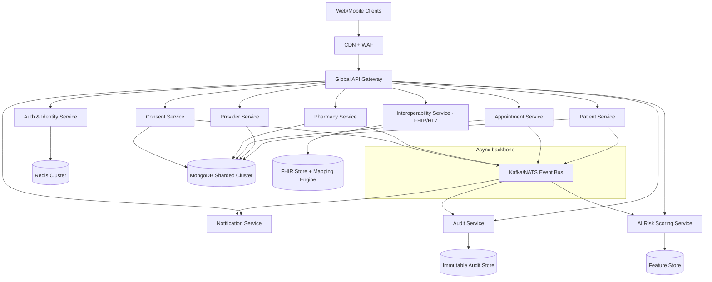

# HealthChain National Healthcare Infrastructure Blueprint

## 1) Target Architecture for 1M+ Users

### 1.1 High-level architecture (cloud-native microservices)



### 1.2 Scale design
- **Request handling**: API Gateway + autoscaled service replicas (HPA) behind Kubernetes services.
- **Data plane**: MongoDB sharded cluster (region-aware) + Redis cluster for low-latency reads/session/ratelimits.
- **Event-driven workflows**: Kafka/NATS for audit events, notifications, AI feature events, and integration exports.
- **Stateless services**: all services remain horizontally scalable; no local disk state.
- **Multi-region strategy**: active-active for read-heavy modules; active-passive DR fallback for critical write modules.

### 1.3 Microservices boundary
- **Identity Service**: registration/login/MFA, token issuance, refresh rotation, federation.
- **Access Control Service**: RBAC/ABAC policy enforcement (can be sidecar/PDP).
- **Patient Service**: demographics, encounters, records references.
- **Clinical Records Service**: observations, diagnosis, procedures, care plans.
- **Appointment Service**: booking, calendars, slot optimization.
- **Telemedicine Service**: session orchestration + tokenization for video provider.
- **Pharmacy Service**: prescriptions, fulfillment, order status tracking.
- **Consent Service**: consent artifacts, purpose-limited sharing rules.
- **Interoperability Service**: FHIR APIs, HL7 v2 ingestion, external connectors.
- **Notification Service**: email/SMS/push templates, retries, DLQ.
- **Audit & Compliance Service**: immutable append-only access logs.
- **AI Service**: risk scoring inference, explanation payload generation.

---

## 2) Security & Compliance Architecture

### 2.1 RBAC + ABAC hybrid
- RBAC roles: `NATIONAL_ADMIN`, `STATE_ADMIN`, `HOSPITAL_ADMIN`, `DOCTOR`, `NURSE`, `PHARMACIST`, `PATIENT`, `INSURER_AUDITOR`, `SYSTEM_AUDITOR`.
- ABAC constraints: location, facility, treatment relationship, consent scope, emergency override.
- Central policy decision point (OPA/Cedar style) queried by all services.

### 2.2 Field-level encryption strategy
- Encrypt sensitive fields (`diagnosis`, `labResults`, `notes`, national IDs) before DB write.
- Use envelope encryption:
  - Data Encryption Key (DEK) per patient/record class.
  - Key Encryption Key (KEK) from cloud KMS/HSM (AWS KMS/Azure Key Vault/GCP KMS).
- Keep ciphertext + key metadata in Mongo; never store raw keys in app config.

### 2.3 Audit logging requirements
- Log every **read/write/export/share** action with:
  - actor, role, patientId, data category, purpose, timestamp, IP/device, outcome.
- Write audit event to immutable store (WORM/S3 object lock + signed hash chain).
- Support compliance search and tamper-evidence verification.

### 2.4 HIPAA-style safeguards mapping
- **Administrative**: least privilege, workforce access reviews, incident runbooks.
- **Technical**: MFA, encryption at rest/in transit, centralized auditing, IDS alerts.
- **Physical (cloud)**: managed provider controls, private subnets, bastion access.

### 2.5 Consent management
- Consent artifact model: patient, grantee, data classes, purpose, validity interval, revocation status.
- Runtime checks: all sensitive API reads must validate active consent unless emergency override policy allows break-glass.
- Break-glass events generate priority compliance alert.

### 2.6 MFA & key management
- MFA options: TOTP + SMS fallback + WebAuthn for admins/clinicians.
- Short-lived access tokens + rotating refresh tokens with device binding.
- Secrets manager for DB creds/API secrets; automatic rotation schedule.

---

## 3) Interoperability Blueprint

### 3.1 FHIR-compliant model approach
- Canonical resources in Interoperability Service:
  - `Patient`, `Practitioner`, `Encounter`, `Observation`, `Condition`, `MedicationRequest`, `Appointment`, `Consent`.
- Internal domain models mapped to FHIR representation via adapter layer.
- Versioned profiles for national extension fields.

### 3.2 HL7 strategy
- Inbound HL7 v2 via MLLP/secure adapters.
- Parse ADT/ORM/ORU messages into normalized event schema.
- Persist raw message for traceability + transformed FHIR resources.

### 3.3 API versioning & partner APIs
- URI versioning for public APIs: `/api/v1/...`, `/api/v2/...`.
- Backward compatibility window + deprecation headers.
- Partner APIs with scoped credentials and contractual quotas.

### 3.4 Digital Health ID compatibility
- Store external health IDs as verified identifiers.
- Identity link table supports many-to-one mappings for migration.
- Verification events signed and auditable.

---

## 4) Advanced Feature Modules

### 4.1 Appointment scheduling
- Slot inventory model (provider, location, specialty, duration, capacity).
- Conflict-free booking using optimistic lock + idempotency key.
- Waitlist and automatic reschedule events.

### 4.2 Telemedicine integration
- Use managed RTC provider (Agora/Twilio/100ms) with server-issued ephemeral room tokens.
- Store metadata only (session ID, participants, consent, start/stop, recording reference).
- Real-time signaling via WebSocket gateway.

### 4.3 Pharmacy order tracking
- Track state machine: `PRESCRIBED -> RECEIVED -> DISPENSED -> IN_TRANSIT -> DELIVERED`.
- Integrate third-party logistics webhooks; sign all webhook callbacks.

### 4.4 Notification and real-time alerts
- Notification Service with template engine and channels (email/SMS/push).
- Critical alerts fan-out through Redis pub/sub + WebSocket for clinician dashboard.
- Retries with exponential backoff and dead-letter queue.

---

## 5) AI Layer Architecture

### 5.1 AI microservice responsibilities
- Isolated AI Inference API with:
  - risk scoring endpoint
  - explanation endpoint
  - model metadata endpoint
- No direct DB access to raw PHI unless explicitly approved through feature pipeline.

### 5.2 ML pipeline
1. Data ingestion from consent-approved datasets/events.
2. De-identification/pseudonymization stage.
3. Feature engineering and validation.
4. Train/validation/test split by time windows.
5. Model registry with signed model artifacts.
6. CI job for model evaluation gates before deployment.

### 5.3 Metrics and explainability
- Binary risk model metrics: AUROC, AUPRC, sensitivity, specificity, PPV, NPV, calibration error.
- Bias checks across age/sex/region cohorts.
- Explainable outputs: top contributing factors (SHAP-like) + confidence interval.

### 5.4 Retraining strategy
- Scheduled retrain monthly + drift-triggered retrain.
- Shadow deployment before canary rollout.
- Rollback to previous model if performance/clinical safety thresholds drop.

---

## 6) Database & Storage Optimization

### 6.1 MongoDB indexing strategy
- Compound indexes on frequent filter + sort paths:
  - appointments: `{ providerId: 1, startTime: 1, status: 1 }`
  - clinical records: `{ patientId: 1, encounterDate: -1 }`
  - audit logs: `{ patientId: 1, ts: -1 }`
- TTL indexes for ephemeral tokens/OTP sessions.
- Partial indexes for active records to reduce index bloat.

### 6.2 Sharding & partitioning
- Shard keys:
  - patient-centric collections: hashed `patientId`.
  - time-heavy collections (audit/events): composite `{ region, dayBucket }`.
- Zone sharding by geography for data residency compliance.

### 6.3 Backup & DR
- PITR backups, daily full + incremental snapshots.
- Cross-region replicated backup vault.
- Quarterly restore drills with RTO/RPO validation.

---

## 7) Monitoring, Reliability & Governance

### 7.1 Observability stack
- **Logs**: Fluent Bit -> OpenSearch/ELK with trace IDs.
- **Metrics**: Prometheus scraping service + infra metrics.
- **Tracing**: OpenTelemetry -> Jaeger/Tempo.
- **Dashboards**: Grafana SLO boards (latency, error rate, saturation).

### 7.2 Resilience patterns
- Circuit breakers, retries with jitter, bulkheads.
- DLQs for async failures.
- Health probes (`liveness`, `readiness`, `startup`) per service.

### 7.3 Zero-downtime deployment
- Rolling updates + pod disruption budgets.
- Canary deployments using service mesh (Istio/Linkerd).
- DB migration pattern: expand/contract, backward-compatible releases.

---

## 8) Suggested Updated Repository Structure

```text
HealthChain/
  frontend/
  backend/
  platform/
    gateway/
      kong/ or nginx/
    services/
      identity-service/
      access-control-service/
      patient-service/
      records-service/
      appointment-service/
      telemedicine-service/
      pharmacy-service/
      consent-service/
      interoperability-service/
      notification-service/
      audit-service/
      ai-inference-service/
    shared/
      contracts/
      events/
      fhir-mappings/
      security/
  infra/
    docker/
    k8s/
      base/
      overlays/
        dev/
        staging/
        prod/
    terraform/
    helm/
  data-platform/
    pipelines/
    feature-store/
    model-registry/
  docs/
    NATIONAL_INFRASTRUCTURE_BLUEPRINT.md
```

---

## 9) API Structure Design (Gateway)

### 9.1 Public API domains
- `/api/v1/auth/*`
- `/api/v1/patients/*`
- `/api/v1/records/*`
- `/api/v1/appointments/*`
- `/api/v1/telemedicine/*`
- `/api/v1/pharmacy/*`
- `/api/v1/consents/*`
- `/api/v1/fhir/*`
- `/api/v1/ai/risk-score`

### 9.2 Request processing pipeline
1. WAF + rate limit by client/app.
2. JWT validation + mTLS (service-to-service).
3. Policy check (RBAC/ABAC).
4. Consent check middleware for PHI endpoints.
5. Route to microservice.
6. Asynchronously emit audit event.

---

## 10) Critical Implementation Snippets (Node.js/Express)

### 10.1 Policy + consent guard middleware

```js
// platform/shared/security/authorize.js
async function authorize(req, res, next) {
  const actor = req.user;
  const action = `${req.method}:${req.baseUrl}${req.route?.path || ""}`;
  const resource = {
    patientId: req.params.patientId || req.body.patientId,
    dataCategory: req.headers["x-data-category"] || "GENERAL_HEALTH",
    purpose: req.headers["x-purpose-of-use"] || "TREATMENT"
  };

  const policyDecision = await policyClient.evaluate({ actor, action, resource });
  if (!policyDecision.allow) {
    return res.status(403).json({ message: "Access denied by policy" });
  }

  if (resource.patientId) {
    const consentOk = await consentClient.validate({
      patientId: resource.patientId,
      actorId: actor.id,
      purpose: resource.purpose,
      dataCategory: resource.dataCategory
    });

    if (!consentOk) {
      return res.status(403).json({ message: "No active consent" });
    }
  }

  req.securityContext = { action, resource };
  next();
}
```

### 10.2 Field-level encryption helper

```js
// platform/shared/security/phiCrypto.js
const crypto = require("crypto");

function encryptField(plaintext, dek) {
  const iv = crypto.randomBytes(12);
  const cipher = crypto.createCipheriv("aes-256-gcm", dek, iv);
  const ciphertext = Buffer.concat([cipher.update(plaintext, "utf8"), cipher.final()]);
  const tag = cipher.getAuthTag();
  return {
    alg: "AES-256-GCM",
    iv: iv.toString("base64"),
    tag: tag.toString("base64"),
    value: ciphertext.toString("base64")
  };
}

function decryptField(payload, dek) {
  const decipher = crypto.createDecipheriv(
    "aes-256-gcm",
    dek,
    Buffer.from(payload.iv, "base64")
  );
  decipher.setAuthTag(Buffer.from(payload.tag, "base64"));
  const plain = Buffer.concat([
    decipher.update(Buffer.from(payload.value, "base64")),
    decipher.final()
  ]);
  return plain.toString("utf8");
}
```

### 10.3 Audit event emission middleware

```js
// platform/shared/security/auditEmitter.js
function auditEmitter(eventBus) {
  return async (req, res, next) => {
    const start = Date.now();
    res.on("finish", async () => {
      await eventBus.publish("audit.log.v1", {
        ts: new Date().toISOString(),
        actorId: req.user?.id,
        role: req.user?.role,
        action: req.securityContext?.action,
        resource: req.securityContext?.resource,
        route: req.originalUrl,
        method: req.method,
        statusCode: res.statusCode,
        latencyMs: Date.now() - start,
        traceId: req.headers["x-trace-id"]
      });
    });
    next();
  };
}
```

### 10.4 AI risk scoring endpoint contract

```http
POST /api/v1/ai/risk-score
Content-Type: application/json
Authorization: Bearer <token>

{
  "patientId": "p_123",
  "featureVectorRef": "fv_2026_02_10_abc",
  "modelVersion": "risk-v5"
}
```

```json
{
  "riskScore": 0.82,
  "riskBand": "HIGH",
  "explanations": [
    { "factor": "hba1c_trend", "impact": 0.21 },
    { "factor": "hypertension_history", "impact": 0.15 }
  ],
  "confidence": 0.89,
  "modelVersion": "risk-v5",
  "generatedAt": "2026-02-10T08:30:00Z"
}
```

---

## 11) MongoDB Schema Improvements (FHIR-aligned examples)

```js
// Patient Profile (aligned with FHIR Patient)
{
  _id,
  healthIds: [{ system: "NATIONAL_HEALTH_ID", value: "...", verified: true }],
  name: [{ given: ["Asha"], family: "Rao" }],
  telecom: [{ system: "phone", value: "+91...", use: "mobile" }],
  gender,
  birthDate,
  address: [{ line: ["..."], city: "...", state: "...", postalCode: "..." }],
  managingOrganization,
  meta: { versionId, lastUpdated }
}

// Consent artifact
{
  _id,
  patientId,
  grantedTo: { type: "Provider", id: "prov_123" },
  purpose: ["TREATMENT", "PAYMENT"],
  dataCategories: ["LAB_RESULTS", "MEDICATIONS"],
  validFrom,
  validTo,
  status: "ACTIVE",
  revokedAt: null,
  metadata: { captureMethod: "OTP", language: "en" }
}

// Audit record (immutable)
{
  _id,
  ts,
  actor: { id, role, organizationId },
  patientId,
  action,
  purpose,
  dataCategory,
  result,
  ip,
  userAgent,
  traceId,
  previousHash,
  recordHash
}
```

---

## 12) Deployment & CI/CD Strategy

### 12.1 Containerization + Kubernetes
- Build each service as independent Docker image.
- Use distroless base images and non-root runtime users.
- Kubernetes:
  - namespaces per environment
  - HPA by CPU + custom QPS metric
  - PDB + anti-affinity for HA

### 12.2 CI/CD pipeline stages
1. Lint + unit tests.
2. SAST + dependency and container scanning.
3. Contract/integration tests.
4. Build and sign image (cosign).
5. Deploy to staging via Helm/ArgoCD.
6. Smoke + synthetic monitoring.
7. Progressive production rollout (canary).

### 12.3 Governance controls in pipeline
- Block deploy if critical CVEs or failed policy checks.
- Enforce IaC policy scan (OPA/Conftest).
- Require compliance approval for schema changes touching PHI.

---

## 13) Phased Migration Plan from Current MERN Setup

1. **Phase 1: Foundation**
   - Introduce API Gateway, Redis, centralized auth service, audit pipeline.
2. **Phase 2: Service extraction**
   - Split appointments, pharmacy, consent, and notifications into dedicated services.
3. **Phase 3: Interoperability**
   - Add FHIR facade + HL7 ingestion adapters.
4. **Phase 4: AI productionization**
   - Deploy separate inference and MLOps stack.
5. **Phase 5: National rollout**
   - Multi-region, DR drills, formal compliance certification.

This roadmap lets existing React + Express features continue operating while incrementally evolving toward a resilient national digital health platform.
